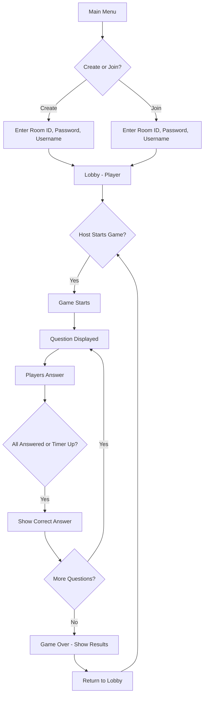

# 🎯 Trivia Home

<div align="center">


**A real-time multiplayer trivia game built with React, Socket.IO, and MongoDB**

[](https://react.dev)
[](https://socket.io)
[](https://mongodb.com)
[](https://tailwindcss.com)
[](https://vitejs.dev)

[Features](#-features) • [Tech Stack](#-tech-stack) • [Getting Started](#-getting-started) • [Game Flow](#-game-flow) • [API](#-api-endpoints)

</div>

---

## ✨ Features

### 🎮 Core Gameplay
- **Create & Join Rooms** - Host private game rooms with passwords or join existing ones
- **Real-time Multiplayer** - Compete with friends using WebSocket-powered live updates
- **Dynamic Avatars** - Choose from 8 DiceBear avatar styles with live preview
- **Configurable Games** - Set question count, time per question, category, and difficulty

### 🏆 Competitive Features
- **Global Leaderboard** - Track top players by wins, games played, and fastest answers
- **Personal Stats** - View your game history, win rate, and performance metrics
- **Scoring System** - Points for correct answers + bonus for fastest answer

### 🎵 User Experience
- **Background Music Player** - Floating music player with volume control
- **Live Chat** - In-game chat with emoji support
- **Persistent Settings** - Sound, notifications, theme preferences saved to database
- **Responsive Design** - Works on desktop and mobile devices

### 🔧 Technical Features
- **Automatic Room Cleanup** - Finished rooms are automatically deleted from database
- **Host Transfer** - If host disconnects, a new host is automatically assigned
- **Smart Timer** - Skips to next question when all players have answered
- **Unique User IDs** - Browser-based persistent user identification

---

## 🛠 Tech Stack

### Frontend
| Technology | Purpose |
|------------|---------|
| **React 19** | UI Framework |
| **Vite** | Build tool & dev server |
| **TailwindCSS** | Styling |
| **Zustand** | State management |
| **Socket.IO Client** | Real-time communication |
| **React Router** | Navigation |

### Backend
| Technology | Purpose |
|------------|---------|
| **Node.js + Express 5** | REST API server |
| **Socket.IO** | WebSocket server |
| **MongoDB + Mongoose** | Database & ODM |
| **bcryptjs** | Password hashing |

### External APIs
- **[Open Trivia Database (OpenTDB)](https://opentdb.com/)** - Trivia questions
- **[DiceBear](https://dicebear.com/)** - Avatar generation

---

## 🚀 Getting Started

### Prerequisites
- Node.js 18+
- MongoDB Atlas account (or local MongoDB)
- Git

### Installation

1. **Clone the repository**
   ```bash
   git clone https://github.com/SujalD04/trivia-home.git
   cd trivia-home
   ```

2. **Set up environment variables**

   Create `.env` in root directory:
   ```env
   MONGO_URI=your_mongodb_connection_string
   ```

   Create `frontend/.env`:
   ```env
   VITE_API_BASE_URL=http://localhost:5000/api
   VITE_SOCKET_SERVER_URL=http://localhost:5000
   ```

   Create `backend/.env`:
   ```env
   PORT=5000
   MONGO_URI=your_mongodb_connection_string
   ```

3. **Install dependencies**
   ```bash
   # Backend
   cd backend
   npm install

   # Frontend
   cd ../frontend
   npm install
   ```

4. **Start the application**
   ```bash
   # Terminal 1 - Backend
   cd backend
   npm start

   # Terminal 2 - Frontend
   cd frontend
   npm run dev
   ```

5. **Open your browser**
   Navigate to `http://localhost:5173`

### Docker Deployment
```bash
docker-compose up --build
```

---

## 🎯 Game Flow



---

## 📁 Project Structure

```
trivia-home/
├── frontend/                 # React frontend
│   ├── src/
│   │   ├── components/       # Reusable UI components
│   │   ├── contexts/         # React contexts (Settings)
│   │   ├── pages/            # Page components
│   │   │   ├── MainMenuPage  # Landing page
│   │   │   ├── HomePage      # Create/Join room
│   │   │   ├── LobbyPage     # Pre-game waiting room
│   │   │   ├── GamePage      # Trivia gameplay
│   │   │   ├── LeaderboardPage
│   │   │   └── SettingsPage
│   │   ├── store/            # Zustand stores
│   │   └── utils/
│   └── package.json
│
├── backend/                  # Node.js backend
│   ├── models/               # Mongoose schemas
│   │   ├── User.js           # User profiles
│   │   ├── Room.js           # Game rooms
│   │   ├── Game.js           # Game history
│   │   ├── UserStats.js      # Player statistics
│   │   └── UserSetting.js    # User preferences
│   ├── routes/               # Express routes
│   ├── server.js             # Main server + Socket.IO events
│   └── package.json
│
├── docker-compose.yml
└── README.md
```

---

## 🔌 API Endpoints

### Stats API
| Method | Endpoint | Description |
|--------|----------|-------------|
| GET | `/api/stats/:userId` | Get user's personal stats |
| GET | `/api/stats/global/top` | Get top 25 players |

### Settings API
| Method | Endpoint | Description |
|--------|----------|-------------|
| GET | `/api/settings/:userId` | Get user settings |
| PUT | `/api/settings/:userId` | Update user settings |

---

## 🔄 Socket Events

### Client → Server
| Event | Description |
|-------|-------------|
| `create_room` | Create a new game room |
| `join_room` | Join an existing room |
| `leave_room` | Leave current room |
| `start_game` | Start the game (host only) |
| `submit_answer` | Submit answer for current question |
| `update_game_settings` | Update room settings (host only) |
| `chatMessage` | Send chat message |

### Server → Client
| Event | Description |
|-------|-------------|
| `room_joined` | Successfully joined room |
| `update_lobby` | Lobby state updated |
| `game_started` | Game has started |
| `new_question` | New question received |
| `answer_feedback` | Your answer result |
| `score_update` | Score changed |
| `time_up` | Question timer expired |
| `game_end` | Game finished with results |

---

## 🎨 Screenshots

<details>
<summary>Click to view screenshots</summary>

### Main Menu
- Start New Game
- How to Play guide
- Leaderboard access
- Settings

### Lobby
- Participant list with avatars
- Game settings (host controls)
- Live chat
- Room password display

### Game
- Question display with timer
- Multiple choice answers
- Real-time score updates
- Answer feedback (correct/incorrect)

### Results
- Final leaderboard
- Coins earned
- Winner announcement

</details>

---

## 🤝 Contributing

Contributions are welcome! Please feel free to submit a Pull Request.

1. Fork the repository
2. Create your feature branch (`git checkout -b feature/AmazingFeature`)
3. Commit your changes (`git commit -m 'Add some AmazingFeature'`)
4. Push to the branch (`git push origin feature/AmazingFeature`)
5. Open a Pull Request

---

## 📄 License

This project is open source and available under the [MIT License](LICENSE).

---

## 👤 Author

**Sujal D**
- GitHub: [@SujalD04](https://github.com/SujalD04)

---

<div align="center">

**⭐ Star this repo if you found it helpful! ⭐**

Made with ❤️ and lots of trivia questions

</div>
